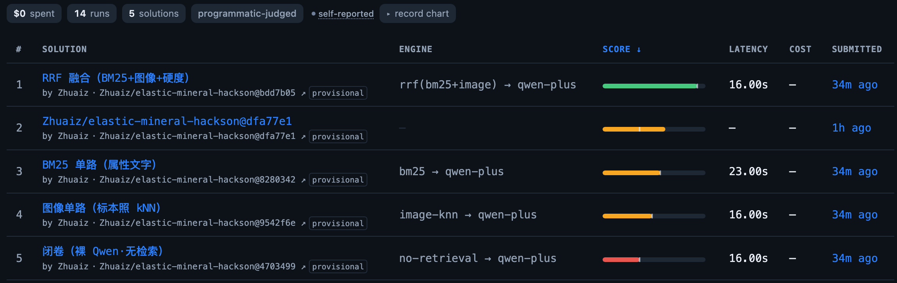

# 🪨 野外矿物鉴定 Agent — 用 Elastic 融合检索，把作答准确率从 36% 拉到 92%

> **Elastic AgentHack 参赛作品。** 地质队员在野外捡到一块石头：一张照片、几条肉眼观察
> （颜色、条痕、硬度、晶系）。玛瑙/玉髓/碧玉光看照片会混，"硬度 7 + 白条痕 + 玻璃光泽"
> 又被几十种矿物共享——**单一模态谁都不够**。我们用 Elasticsearch 的 `rrf` retriever
> 把图像 kNN、属性 BM25、结构化过滤**在一个查询里融合**，并用两层公开可验证的数字证明它有用。

## 📊 头条数字：公开榜单上的检索消融

同一套 50 题、同一个 judge、同一个 qwen-plus，只变检索配置——四个 solution 同台公开对比：

| 检索配置 | 作答准确率 | vs 闭卷 |
|---|---|---|
| 闭卷（裸 Qwen） | 36.0% | — |
| 图像单路（jina-clip-v2 kNN） | 48.0% | +12 |
| BM25 单路（属性文字） | 56.0% | +20 |
| **RRF 融合（BM25 + 图像 kNN + 硬度过滤）** | **92.0%** | **+56** |

[](https://trapstreet.run/tasks/mineral-species-id)

▶ **公开榜单（可点进每个 case 看判分）**: [trapstreet.run/tasks/mineral-species-id](https://trapstreet.run/tasks/mineral-species-id)

检索层的独立证据（不调 LLM，2,749 条查询的检索命中率）：

| | image 单路 | text 单路 | **RRF 融合** |
|---|---|---|---|
| top-1 | 20.8% | 23.9% | **53.3%** (+29.4) |
| top-3 | 37.9% | 28.0% | **77.5%** |

两层数字互相印证：**检索越强 → 喂给模型的证据越好 → 作答越准，RRF 处最高。**

## 🏗️ 架构

```
矿物图片(5,498张/98种) ──jina-clip-v2──> image_vector ┐
Mindat 属性 + Wikipedia 摘要 ──────────> props_text  ├─> ES minerals-images（RRF: BM25+kNN+过滤）
                                        结构化字段    ┘    minerals-species（ES|QL 工具）
Agent Builder: mineralogist agent = ES|QL 属性工具 + Workflow 包 RRF 融合查询
作答: ES /_inference/completion/qwen-plus（推理端点，全链路不出 Elastic）
评测: trapstreet 公开任务（trap/task）+ 本地消融 harness（trap/eval）
```

**为什么这是 Elastic 的主场**：
- 一条 `rrf` retriever DSL 同时融合三路信号——不用自己写融合逻辑，不用两套系统
- jina-clip-v2 图文**同一 1024 维空间**：文字线索可以直接 kNN 搜标本照片（跨模态）
- Agent Builder 的 agent 自己决定先按硬度筛还是先按图搜；中文提问也行（jina 文本塔 89 语）
- 连 LLM 作答都走 ES `_inference` 端点——检索、推理、评测一条链路全在 Elastic 生态里

## 🎬 演示

```bash
source .env && .venv/bin/python demo/app.py   # → http://localhost:8000
```

拖一张标本照片进去，三栏并排：只看图 / 只看字 / RRF 融合。
前两栏把玛瑙玉髓碧玉混在一起，融合栏第一名锁定——**这一栏赢，就是 RRF 的价值。**

- 4 分钟讲稿：[docs/PITCH.md](docs/PITCH.md) · 现场手册：[docs/DEMO_RUNBOOK.md](docs/DEMO_RUNBOOK.md)

## 🚀 复现

### 用 trapstreet CLI 直接跑（推荐）

四个检索配置就是 `trap.yaml` 里的四个命名 task，`tp run` 即可复现榜上任意一行：

```bash
cp .env.example .env && vi .env             # 填 ES_URL + ES_API_KEY（见下）
pip install -r trap/solutions/requirements.txt   # 只需 elasticsearch 客户端
source .env

tp run mineral-rrf            # 满配 RRF   → 榜上 0.92 (46/50)
tp run mineral-closed-book    # 裸 Qwen    → 榜上 0.36 (18/50)
tp run mineral-bm25           # BM25 单路  → 榜上 0.56 (28/50)
tp run mineral-image          # 图像单路   → 榜上 0.48 (24/50)
tp submit mineral-species-id  # 上传自己这次的 run
```

每个 case：`trap/solutions/solve.py` 读题面 → ES 检索证据 → qwen-plus 作答 → judge 判分，
作答和检索都在 ES 集群上（本机零模型）。

### 公开 ES 端点 + 限权 key（让任何人都能跑）

端点已在 `.env.example` 里公开。复现用的 `ES_API_KEY` 必须是一个**只读 + 只调推理端点**的
限权 key —— **绝不要公开超管 key**（它能删库、无上限刷推理账单，泄露即灾难）。

集群 owner 用超管权限生成限权 key（`role_descriptors` 把权限锁死在 minerals-* 只读 +
`monitor_inference`），把返回的 `encoded` 值作为公开的 `ES_API_KEY`：

```bash
curl -s -H "Authorization: ApiKey $ADMIN_KEY" -H "Content-Type: application/json" \
  "$ES_URL/_security/api_key" -d '{
    "name": "mineral-public-reproduce",
    "role_descriptors": {
      "minerals_ro_infer": {
        "cluster": ["monitor_inference"],
        "indices": [{"names": ["minerals-*"], "privileges": ["read", "view_index_metadata"]}]
      }
    }
  }' | python3 -c "import json,sys; print(json.load(sys.stdin)['encoded'])"
```

这个 key 只能读 minerals-* 索引 + 调 qwen 推理端点，**不能删/写/改集群任何东西**。
仍建议在阿里云侧对 AI 平台设预算上限，防止付费推理被刷量。

### 关于"能不能跑出一模一样的结果"

- **判分完全确定**：committed 的作答（`trap/solutions/answers/*.txt`）就是榜上那批 run 的原始答案。
  无需任何凭证即可本地重判、复现出分毫不差的 36/48/56/92：
  ```bash
  for c in closed_book image bm25 rrf_w100; do
    python trap/solutions/submit.py $c --engine x --strategy x --dry-run
  done
  ```
- **检索完全确定**：题面线索固定、语料索引固定、图像查询向量随仓库提交
  （`trap/solutions/query_vectors.json`，即榜上那批 run 用的同一批标本照向量），
  给定同一个 ES 语料，检索结果逐 case 可复现。
- **作答近似确定**：qwen-plus 用 `temperature=0` 贪心解码，实测逐题重跑与 committed 一致；
  但 LLM 采样非严格确定，个别 case 可能漂移 ±1~2 题。所以**曲线形状（闭卷<单路<RRF）稳定复现**，
  绝对题数可能有小幅抖动——这是模型侧的固有噪声，不是 solution 的问题。
- **唯一前置**：要一个装了 `qwen-plus` 等推理端点、且灌好 `minerals-images` 索引的 ES 集群。
  榜上用的是私有阿里云托管 ES；换你自己的集群同样能跑，按下方"从零重建"建好索引与端点即可。

### 从零重建语料（可选）

```bash
python scripts/fetch_properties.py merge    # 1. 属性数据（Wikipedia + Mindat）
python scripts/embed_images.py              # 2. jina-clip-v2 嵌入（5,498 张）
python scripts/index_es.py                  # 3. 建索引 + 入库
python scripts/setup_inference.py           # 4. 建 ES jinaai 推理端点
python trap/eval/ablation.py                # 检索命中率消融（上表二）
python trap/eval/accuracy_vs_retrieval.py   # 作答准确率四配置（上表一）
```

## 📁 目录

```
scripts/           数据管线：属性抓取 → 嵌入 → 入库 → 检索 CLI
demo/              三栏对比演示（标准库 http.server，零依赖）
agent-builder/     Agent Builder agent + Workflow RRF 工具定义
trap.yaml          tp run 入口：四个检索配置 = 四个命名 task
trap/task/         trapstreet 公开任务（50 case + judge，官方 traptask 格式）
trap/eval/         两层评测 harness（检索消融 + 作答准确率曲线）
trap/solutions/    solve.py（tp 可跑）+ 四配置作答 + 榜单提交器 + committed 查询向量
docs/              讲稿 / 演示手册 / 内部运维笔记
```

## 📜 数据与许可

- 图片与标签：MineralImage5k-98（Nesteruk et al. 2023，Fersman 矿物博物馆）——**仅本地演示，不再分发**
- 属性：Mindat API（CC-BY-NC-SA，不再分发）+ Wikipedia 摘要（CC BY-SA 4.0，已署名）
- 嵌入：jina-clip-v2（CC-BY-NC-4.0，演示需标注）
- trapstreet 公开任务仅含客观物性数值 + Wikipedia 文本，公开安全

> 集群选型、冒烟测试、已知边界等内部笔记 → [docs/OPS-NOTES.md](docs/OPS-NOTES.md)
> 选型依据 → [RESEARCH-选型报告.md](RESEARCH-选型报告.md)
